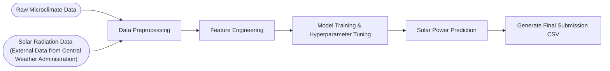

# AI-Cup-2024-Power-Prediction
深度學習｜⚡ AI Cup 2024：基於區域微氣候資料之發電量預測模型 (Power generation prediction based on regional microclimate data) 

## ⚙️ Workflow Architecture


## 📂 Repository Structure
```text
AI-Cup-2024-Power-Prediction/
├── competition-guidelines/       # 競賽官方說明文件與範例程式
├── sample-data/
│   └── L1_Train.csv              # 測站 1 之微氣候訓練數據（共 17 個觀測站）
├── scripts/
│   └── power_prediction.ipynb    # 程式碼：涵蓋探索式資料分析、資料前處理、訓練與生成預測結果
├── reports/                      
│   ├── report_slides.pdf         # 專案簡報
│   └── report.pdf                # 專案完整技術報告
├── checkpoints/                  # 存放訓練完成之模型權重
├── submission-prediction-csvs/   # 最終上傳至 AI CUP 系統之預測 csv 檔
└── README.md
```
